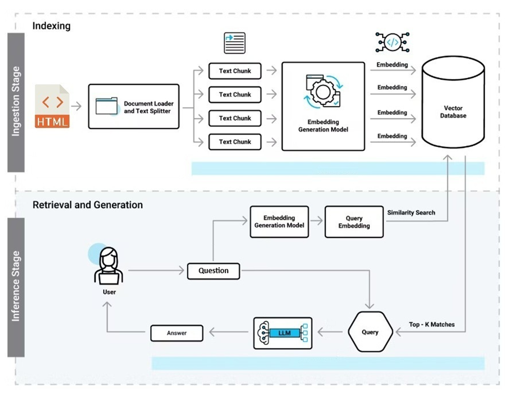

**AI-Powered Q&A System with Spring Boot, Ollama, and Weaviate**

**Application Design and Flow**
The project uses Spring Boot and Spring AI to build a REST API for answering questions based on company documents. 
A directory watcher monitors for new HTML files, which are manually extracted and placed in a folder. 
These files are chunked based on <h2> and <h3> tags, embedded using Ollama nomic-embed-text, and stored in Weaviate. 
The query-response flow begins when a user sends a question to the Spring Boot REST API. 
The query is embedded using Ollama nomic-embed-text and compared against stored vectors in Weaviate. 
The top relevant chunks are retrieved and combined into a context string. 
This context, along with the original query, is passed to Ollama Mistral, which generates a response.



**Technology Stack**
Spring Boot & Spring Web for application core and REST API.
Spring AI to integrate with Ollama models for embeddings and LLM responses.
Weaviate for vector storage and retrieval.
Jsoup for HTML parsing and chunking.

How to Start the instance:
1. Ensure Ollama is installed and running locally with the required models (nomic-embed-text and Mistral).
2. Ensure Weaviate is running locally (e.g., via Docker).
3. Configure application properties (e.g., Ollama and Weaviate endpoints).
4. Run the Spring Boot application.
5. Place HTML files in the monitored directory to trigger processing.
6. Send queries to the REST API endpoint to receive answers based on the document content.
7. Example REST API call:
   - POST /api/ask with TEXT body: "Your question here"
   - Response: Generated answer based on document context.
   - Example using curl:
     ```
     curl -X POST http://localhost:8080/api/ask -H "Content-Type: text/plain" -d "What is Spring Boot?"
     ```
     
**How to Start Ollama:**
1. Install Ollama from https://ollama.com/.
2. Download the required models:
   - `ollama pull nomic/embedding-text`
   - `ollama pull mistral`
3. Start the Ollama service using one of the following commands:
   - `ollama daemon` (Mode of Operation Background)
   - `ollama serve` (Mode of Operation Foreground)
   - This will start Ollama and make the models available for embedding and LLM tasks.
   - You can verify Ollama is running by executing:
     ```
     ollama list
     ```
     This should display the downloaded models.

**How to Start Weaviate:**
1. Ensure you have Docker installed on your machine.
2. Pull the Weaviate Docker image:
   ```
   docker pull semitechnologies/weaviate:latest
   ```
3. Run Weaviate using Docker:
   ```
   docker run -d -p 8080:8080 semitechnologies/weaviate:latest
   ```
4. You can verify that Weaviate is running by accessing the GraphQL endpoint in your web browser or using curl:
   ```
   curl -X POST http://localhost:8080/v1/graphql -H "Content-Type: application/json" -d "{"query":"{ Get { ConfluenceDoc { title url content createdAt updatedAt tags metadata } } }"}"
   ```
   You should see a response indicating that Weaviate is ready.
5. You can now interact with Weaviate via its REST API at `http://localhost:8080/v1/`.
6. For more advanced configurations, refer to the official Weaviate documentation: https://weaviate.io/developers/weaviate/installation/docker
7. Make sure to adjust the Weaviate endpoint in the Spring Boot application properties if you are running it on a different host or port.
8. Once Weaviate is running, the Spring Boot application will automatically create the necessary schema for storing document chunks when it processes HTML files.
9. You can monitor the Weaviate logs using:
   ```
   docker logs -f weaviate
   ```
10. To stop Weaviate, use:
    ```
    docker stop weaviate
    ```
**Note:** Ensure that both Ollama and Weaviate are running before starting the Spring Boot application to ensure proper functionality.
